# Tableau

Tableau is a Business Intelligense Platform

### Start page

Here you can connect data and see your previous workbooks

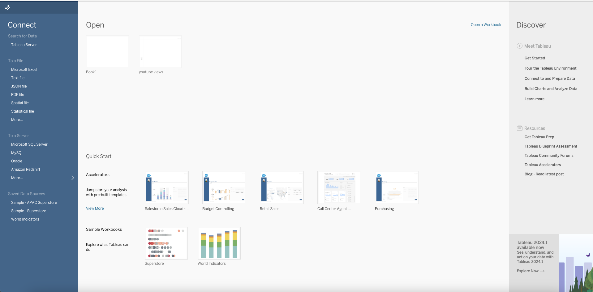

### Data source page

Here we can find The data model in the top, preview of our data and the metadata for our data

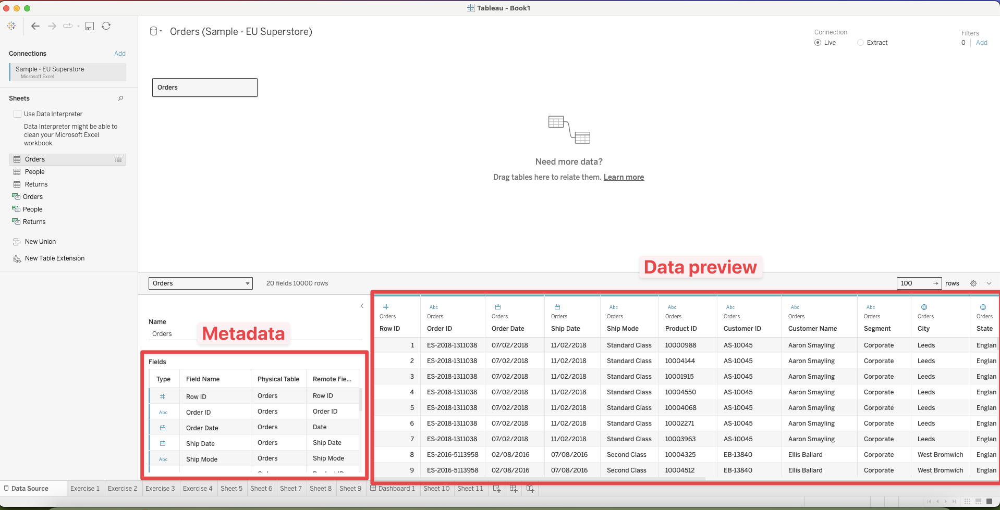

## Workspace page

Go here by clicking in the bottom Sheet 1. This is where we will create most of our visualisations.

**Toolbar** has quick access to most used functionalities. 

**Data/analytics Panes**. Switch between them by clicking in the top of the pane. 

Analytics pane will give you fx average lines or clusters

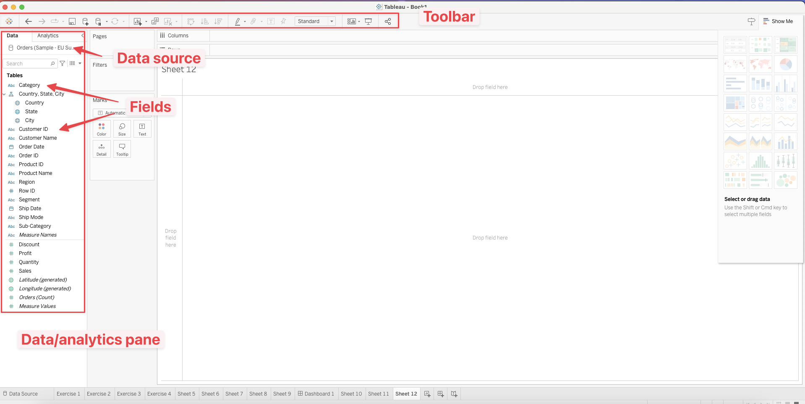

### Column vs rows

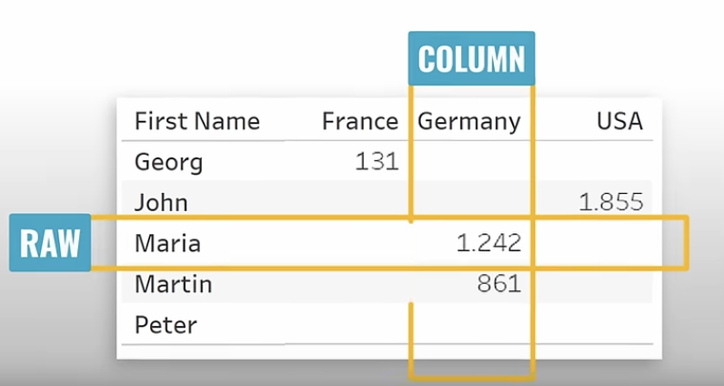

The column and rows decides what should be displayed as columns or rows. It decides how data is visualized on a worksheet. 

 Fx here country is as columns:

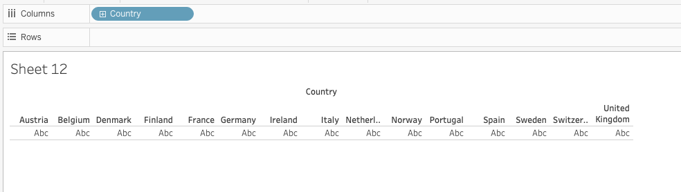

Here they are as rows:

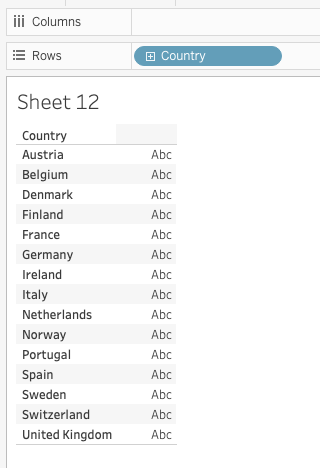

#### Pages shelf

Seperate the current visualisation into seperate pages. 

Say fx i wanted to see product sales divided into category and sub-category by each country. Then i drag Countries to pages. Now in the right there is a page where i can control the countries by clicking on the buttons with arrows. 

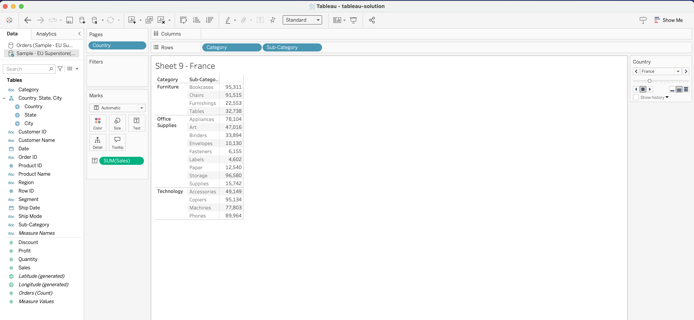

#### Filters

Here we can also drag a field and filter that data, specifying what we want to filter out. 

#### Marks

This can be used for designing the visual. Drag a field on top of either Colour, Size or Label. Label will just show the text

#### Visualisation view

Marks could be lines, bars, circles, etc. 

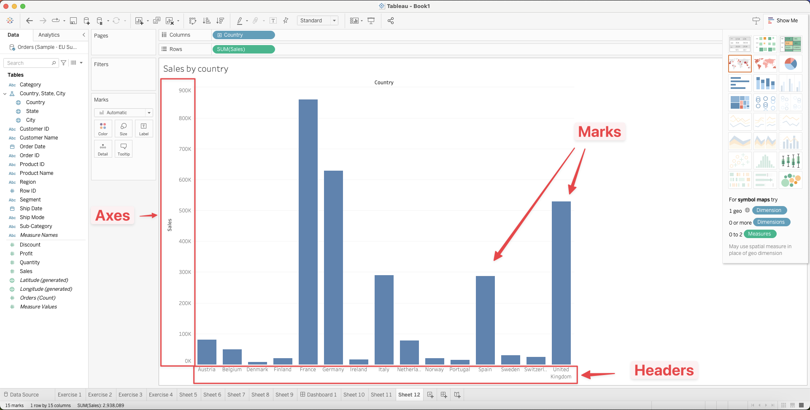

#### Show me

Contains the different visualisations that are available. If there are visualisations that are greyed out. That means they cannot be used. In the bottom you can see what you need to do to activate it. For the example in the screenshot it needs 1 date, no dimensions and 1 or more measures. 

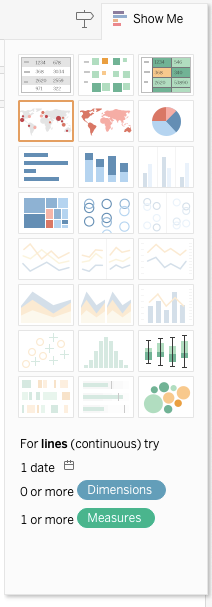

#### Measure vs dimensions

Measure are numbers, Discount, sales, quantity, etc. You can see them beneath the line in the data pane where they have a green color. Continuous

Dimensions are text Country, customer name, region, category. Discrete. 

Date can be both a measure or a dimension, why?

### Dashboard

Dashboard combines different worksheets.

To create a new dashboard click on the button shown below

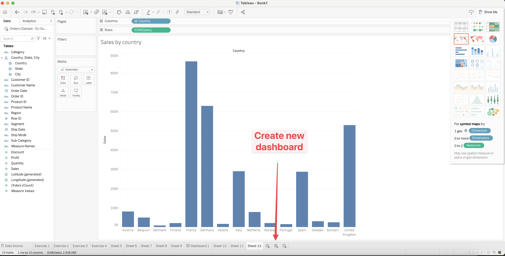

Here we can drag and drop the different worksheets onto our dashboard. 

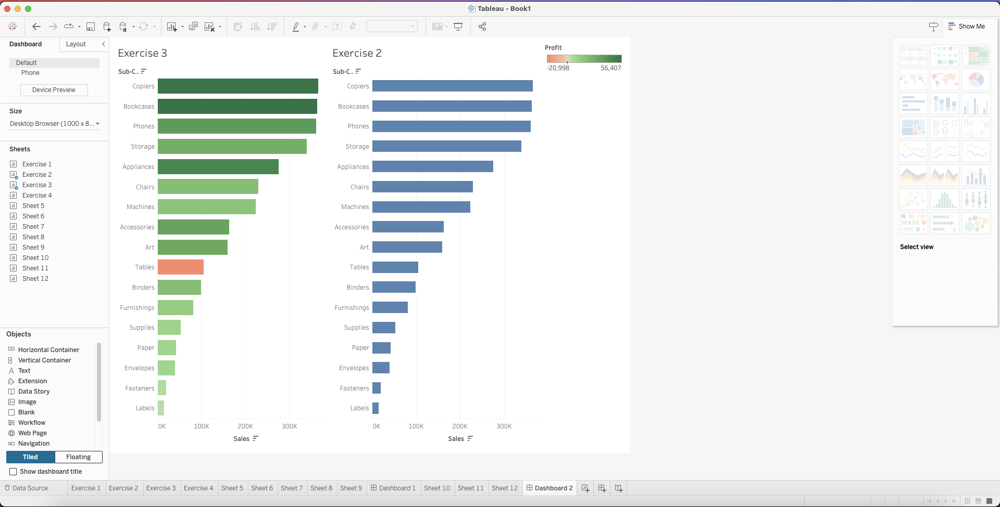

### Measure names and Measure values

Measure names is a representation of all the measures we have. Measure values is a representation of all the values we have, from smallest to largest. [https://www.youtube.com/watch?v=1uhOlZhN5GU](https://www.youtube.com/watch?v=1uhOlZhN5GU)

With these values we can show multiple marks using the same axes. 

If we do measure names we can basiscally filter those measures showing only the ones we are interested in. 

### Same axis multiple measures

https://www.youtube.com/watch?v=K3pXnbniUcM&t=55310s

### Axis

Same axes, different axis, dual axis: [https://youtu.be/K3pXnbniUcM?si=s8HqU_FkEy-7wtzP&t=55310](https://youtu.be/K3pXnbniUcM?si=s8HqU_FkEy-7wtzP&t=55310)

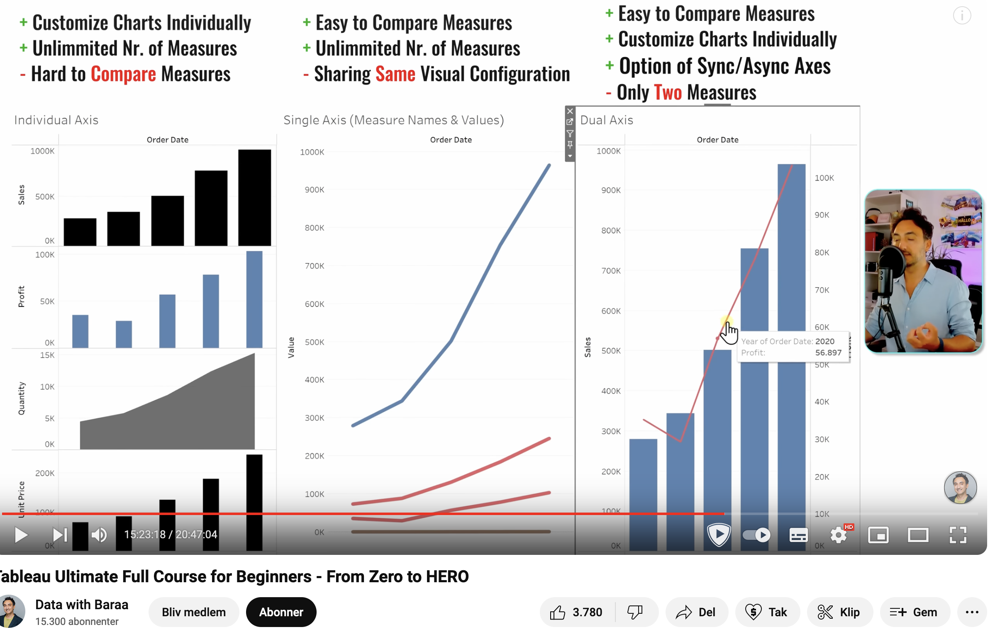

### Two different types of dates

Counting on just monts but for all years. So 2021 and 2022 count in the month of February.

Or we can have continuous where a monts is only counted for the year it is in. 

### Labels on line charts

Click on `Label` -> `Show mark label` -> Now select where you want the label

## Tableau file types

### Tableau  workbook (.twb)

Stores visualisation without source data

### Tableau packages workbook (.twbx)

Stores extracted data **and** visualisations for viewing

## Links

- [Tableau Ultimate Full Course (21 Hours) for Beginners - From Zero to HERO](https://www.youtube.com/watch?v=K3pXnbniUcM)
