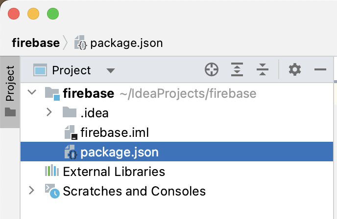
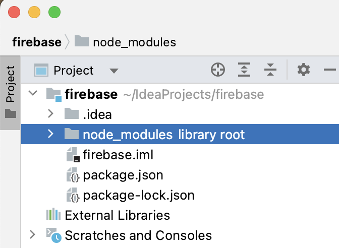
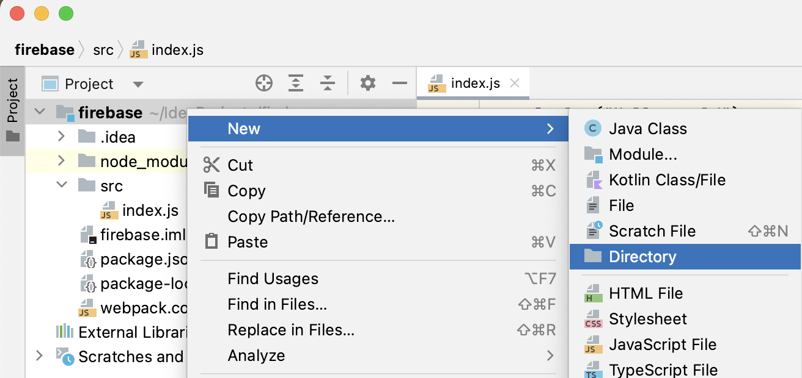
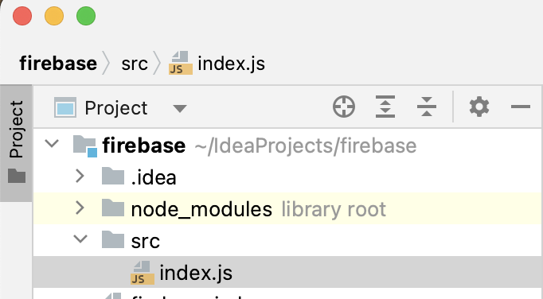
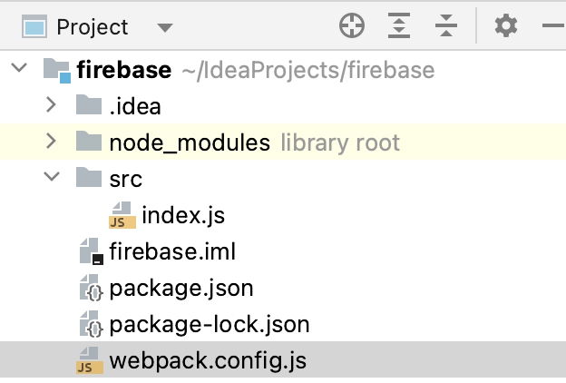
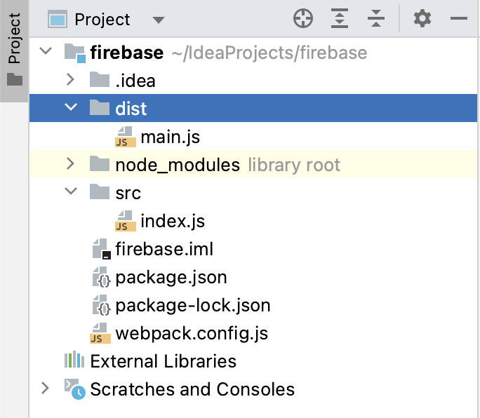
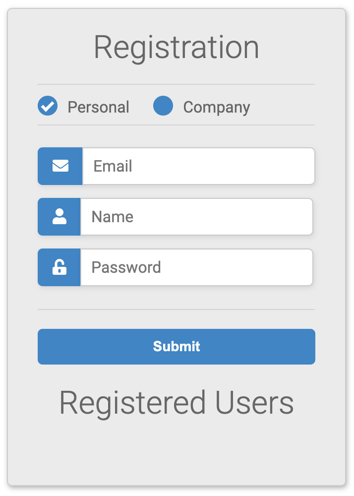
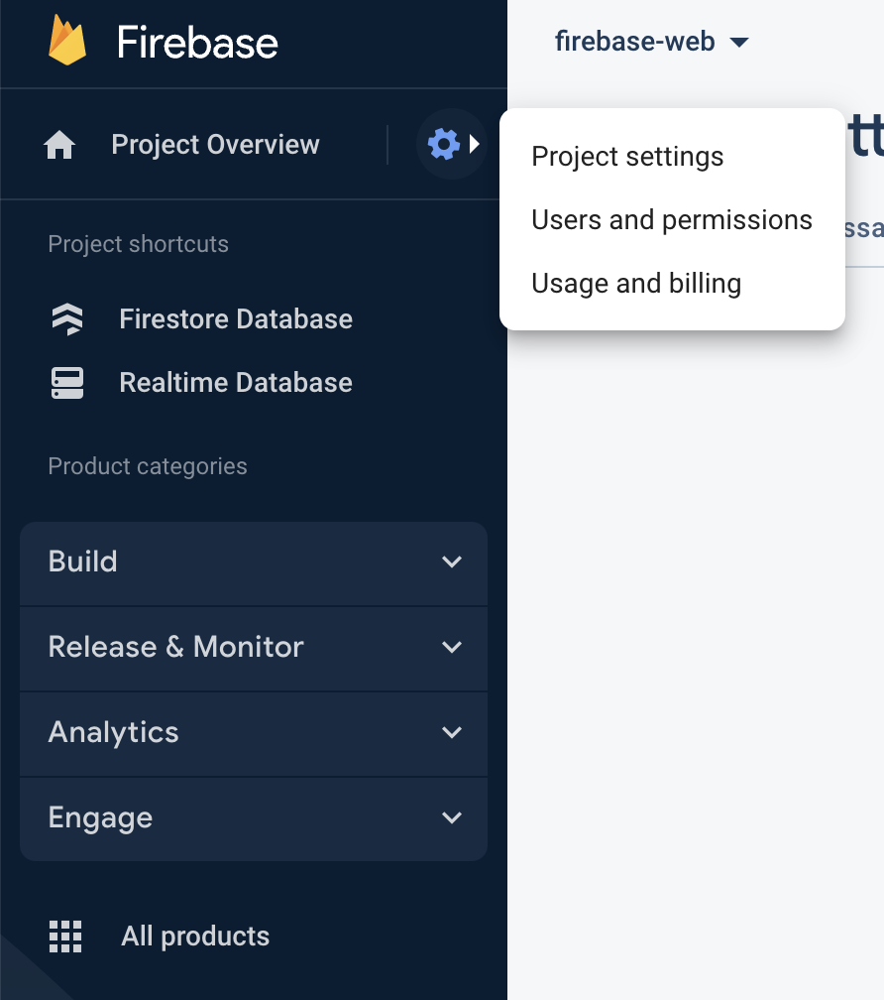
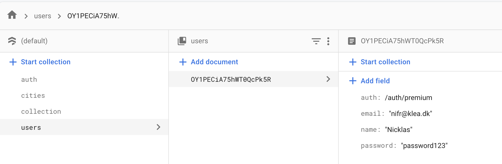
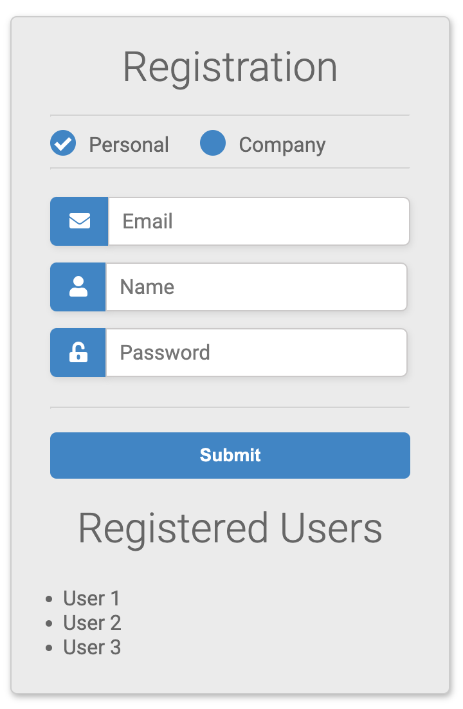

#### This is an individual assignment - as you all need a local development environment


# Creating a development environment for Firebase

### 1. Initiate an empty project in webstorm

### 2. Ensure that the following applications are installed on your computer

### Node

https://nodejs.org/en/download

### NPM

[What is NPM](https://youtu.be/pa4dc480Apo?si=1UV-XFa8eokX-0jV)

In the Webstorm terminal

```bash
npm install -g npm
```


In the Webstorm terminal

**Verify that the packages are installed**

```bash
node -v // It is installed if you see something like this (different version is fine): v18.9.1
npm -v // It is installed if you see something like this (different version is fine): 8.19.1
```


### Initiate NPM on your current project

```bash
npm init -y
```

Notice that you have a new file in the file-tree: package.json:



```json
//package.json should have content like this
{
  "name": "firebase",
  "version": "1.0.0",
  "description": "",
  "main": "index.js",
  "scripts": {
    "test": "echo \"Error: no test specified\" && exit 1"
  },
  "keywords": [],
  "author": "",
  "license": "ISC"
}

```


### Webpack

[What is webpack](https://youtu.be/5zeXFC_-gMQ?si=4MsHzWtb-X8xGpTM)

To install Webpack:

In the Webstorm terminal

```bash
npm install webpack webpack-cli --save-dev
```

Notice that you have a new folder node_modules



**Node modules contain dependencies. Dependencies are external software packages we will use to develop software**

**We will use webpack, firebase and much more as dependencies to build an application**


#  Building an application using webpack

To accommedate webpacks build step (converting multiple javascript files into a single that can be deployed and run)

1. Create a new directory in the project root called `src`



2. Create a javascript file in the `src`folder called `index.js` such as this:



3. Create a javascript file the project root called `webpack.config.js`

   

4. Insert the following content in  `webpack.config.js`:

   ```javascript
   const path = require('path');
   
   module.exports = {
       entry: './src/index.js',
       output: {
           filename: 'main.js',
           path: path.resolve(__dirname, 'dist'),
       },
   };
   ```

5. Change  `package.json` to the following

```json
{
  "name": "firebase",
  "version": "1.0.0",
  "description": "",
  "main": "src/index.js",
  "scripts": {
    "test": "echo \"Error: no test specified\" && exit 1",
    "build": "webpack"
  },
  "keywords": [],
  "author": "",
  "license": "ISC",
  "devDependencies": {
    "webpack": "^5.88.2",
    "webpack-cli": "^5.1.4"
  }
}
```


#### Build the application with webpack

Run the following command in the terminal

```bash
npm run build
```

If successful you should see an output like this:

```apl
asset main.js 27 bytes [emitted] [minimized] (name: main)
./src/index.js 27 bytes [built] [code generated]

WARNING in configuration
The 'mode' option has not been set, webpack will fallback to 'production' for this value.
Set 'mode' option to 'development' or 'production' to enable defaults for each environment.
You can also set it to 'none' to disable any default behavior. Learn more: https://webpack.js.org/configuration/mode/

webpack 5.88.2 compiled with 1 warning in 112 ms
```

**Notice a new folder / file** `dist` & `main.js`



#### What just happened?

- We configured the project using `package.json` and `webpack.config.js` to make npm and webpack work together
- Basically we configured the project such that:
  - When the command `npm run build` is called
  - Webpack takes javascript from the index.js file and all relevant dependencies
  - And builds a new file containing all dependencies in `main.js`


### Create 2 files in the `dist` folder: index.html & style.css

Copy the content from here:

https://github.com/nicklasdean/firebase/blob/main/dist/index.html

https://github.com/nicklasdean/firebase/blob/main/dist/style.css

- When you run the HTML file it should look like this:



Your project should look like this

## Exercise 1

Expand the application such that: 

- When a user clicks the submit button - the users e-mail, name and password are logged to the console or displayed as an alert.

**Notice**: Now we can use the user-data in javascript


# Building an application using Firebase: Cloud Firestore

### Create a firebase project

##### Follow the following steps in this [guide](https://firebase.google.com/docs/web/setup)

- Create a firebase project
- Register your app
- Install firebase using NPM


### Create a Cloud Firestore project 

**Follow the following steps in this [guide](https://firebase.google.com/docs/firestore/quickstart)**

- Use Test mode
- Select an EU location for the database

Use the configuration from `Web modular API`

**Do not Prototype and test with Firebase Local Emulator Suite**

You can find your configuration object in Project Settings:



It should look something like this

```javascript
// Your web app's Firebase configuration
const firebaseConfig = {
  apiKey: "AIza23SyATrCghAasdfmsYhr-I3920KgtoJI8E",
  authDomain: "fir31-wdeb-asd050.firebaseaprfp.com",
  projectId: "fir-wefsb-asdfd050",
  storageBucket: "fi3123r-web-84050f.appeerspot.com",
  messagingSenderId: "4391asd123sd37122",
  appId: "1:439asdsad737122:23web:d5b490c386808a89a7183b"
};
```


## Exercise 2

Follow the following [guide](https://firebase.google.com/docs/firestore/query-data/get-data) to verify if you can create / log data from Cloud Firestore

Initiate project

```javascript
import { initializeApp } from "firebase/app";
import { getFirestore } from "firebase/firestore";

// TODO: Replace the following with your app's Firebase project configuration
// See: https://support.google.com/firebase/answer/7015592
const firebaseConfig = {
    FIREBASE_CONFIGURATION
};

// Initialize Firebase
const app = initializeApp(firebaseConfig);


// Initialize Cloud Firestore and get a reference to the service
const db = getFirestore(app);

```

Inserting data (these lines of code should be deleted when you see data in the firebase console)

```javascript
import { collection, doc, setDoc } from "firebase/firestore"; 

const citiesRef = collection(db, "cities");

await setDoc(doc(citiesRef, "SF"), {
    name: "San Francisco", state: "CA", country: "USA",
    capital: false, population: 860000,
    regions: ["west_coast", "norcal"] });
await setDoc(doc(citiesRef, "LA"), {
    name: "Los Angeles", state: "CA", country: "USA",
    capital: false, population: 3900000,
    regions: ["west_coast", "socal"] });
await setDoc(doc(citiesRef, "DC"), {
    name: "Washington, D.C.", state: null, country: "USA",
    capital: true, population: 680000,
    regions: ["east_coast"] });
await setDoc(doc(citiesRef, "TOK"), {
    name: "Tokyo", state: null, country: "Japan",
    capital: true, population: 9000000,
    regions: ["kanto", "honshu"] });
await setDoc(doc(citiesRef, "BJ"), {
    name: "Beijing", state: null, country: "China",
    capital: true, population: 21500000,
    regions: ["jingjinji", "hebei"] });
```

Fetching a single document 

```javascript
import { doc, getDoc } from "firebase/firestore";

const docRef = doc(db, "cities", "SF");
const docSnap = await getDoc(docRef);

if (docSnap.exists()) {
  console.log("Document data:", docSnap.data());
} else {
  // docSnap.data() will be undefined in this case
  console.log("No such document!");
}

```

Fetching multiple documents

```javascript
import { collection, getDocs } from "firebase/firestore";

const querySnapshot = await getDocs(collection(db, "cities"));
querySnapshot.forEach((doc) => {
  // doc.data() is never undefined for query doc snapshots
  console.log(doc.id, " => ", doc.data());
});
```


## Exercise 3 (Advanced)

Create a collection in Cloud Firestore such as this: 



Expand your web-application such that instead of showing dummy data like this:



- The users from cloud firestore are displayed. **Only their name**, as email and password are sensitive information

  

##### Web namespaced API

- Web namespaced API > Tree shaking
- Modern way to require firebase
- Does not require bundler


Dagsorden

- ~~Lave opsætning igen~~
- ~~Forstå datamodellen dybdegående~~

(Optional)

https://youtu.be/lW7DWV2jST0?si=_caM4Ml1c_sdDGxH

Lektie

https://youtu.be/v_hR4K4auoQ?si=HMneyTdamYlzZ1mD

https://youtu.be/Ofux_4c94FI?si=1ByAIiTb9rbaVBwO

- ~~Forklare NoSQL~~
- CRUD i Cloud Firestore **mangler fx eksempler?**
  - ~~Collection~~
  - Subcollection

2. prioritet

- Crud med authentication "teoretisk"
- Opsætte login
- Finde session -> evt. noget id halløj
  - Jeg er logget ind - vis mig mit data - hvordan 