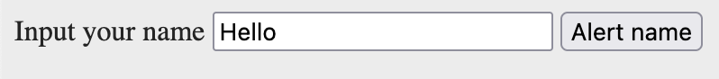

# Web for portfolioproject


- Lets talk about git
  - [Uploading a project that is already on your computer](04-git#clone-a-project-from-github-down-to-your-computer)
  - [Creating a new project by cloning a repository](04-git#create-a-new-project-locally)
- Getting value from an input field


## Getting value from an input field

If we have an `input` field and want to get the value (the text) written in the `input` we have to do two things:

1. First select the `input` field using `querySelector`
2. Get the `value` of that input field using `.value` on the selected `input` element


Here is an example:

**HTML**

```html
<body>
  <label for="name">Input your name</label>
  <input type="text" id="name" placeholder="Please write your name">
  <button>Alert name</button>

  <script src="main.js"></script>
</body>
```




**Javascrtipt**

```javascript
const button = document.querySelector("button");
const inputElement = document.querySelector("input");

button.addEventListener("click", () => {
    const valueInputted = inputElement.value;
    console.log(valueInputted);
})
```

