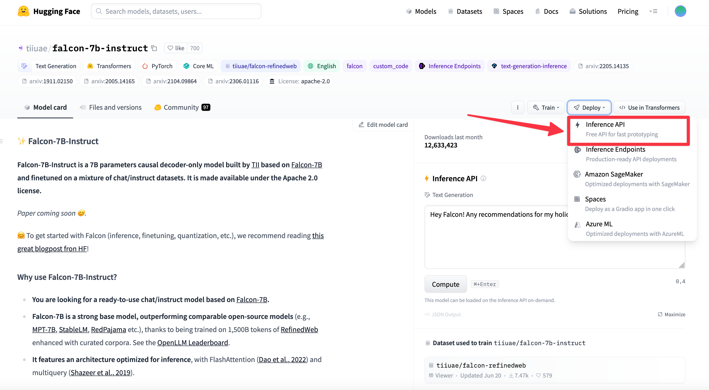
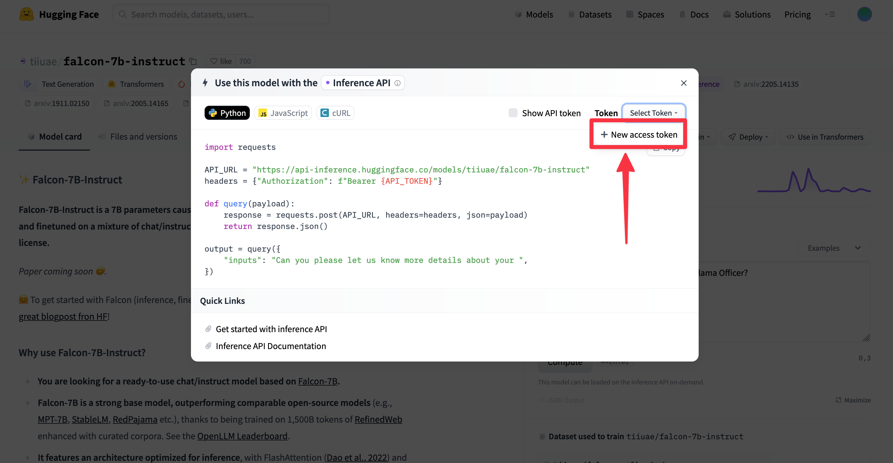
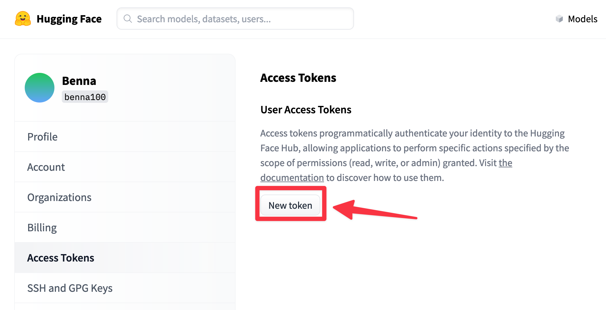
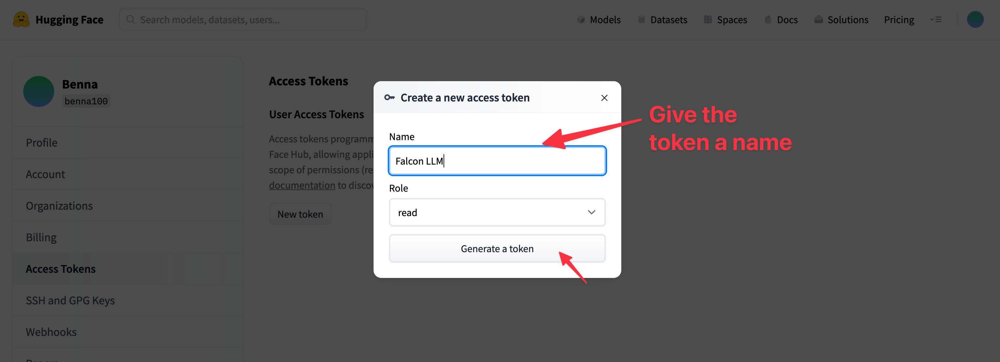
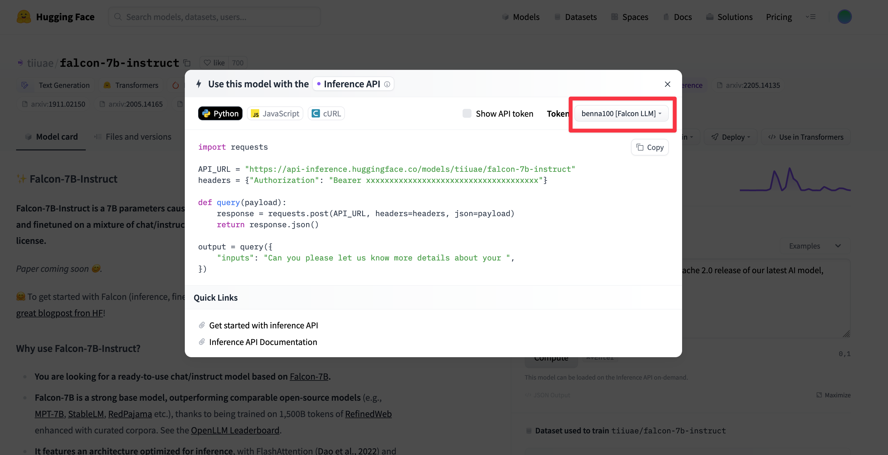
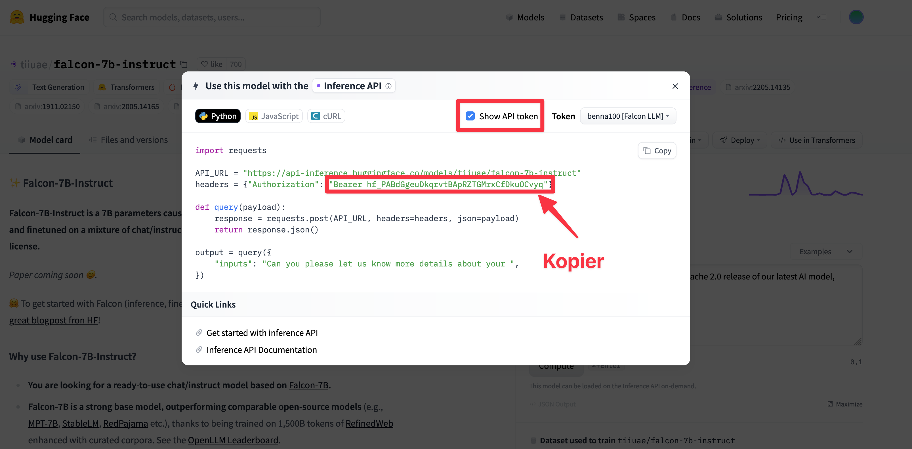

# Let's build a Generative AI tool


## Learning objectives

- Working with a text-to-text model
- Writing prompts
- Using API's


<!--

## Afterclass consideration

- Det var en god dag idag og det er fedt at se de studerendes kreativitet i spil. 
- De fik arbejdet en masse med prompting, hvilket var fedt at se
- Jeg tænkte at kunne køre projektet to gange, men det bliver nok lige lidt meget. De får tid til deres 5. tværfaglige projekt

-->


## Getting started

We first need to be able to interact with a LLM through some kind of API. That will make it possible for us to `fetch` some data in javascript and then use that data for our web application. There are alot of different ways of getting access to an api with a LLM behind. I will be going through some ways here:


It's up to you which way you choose!


### Huggingface API - Free

Huggingface is a machine learning and data science platform and community that helps users build, deploy and train machine learning models


On Huggingface we can find a LLM, deploy an API for that model that only we can use and then start sending requests to that API.


The following is 10 dishes that can be made with cinnamon


#### Deploying the model to get an API

We can for free deploy a LLM model on Hugging face the following way:

1. Create a new user at [https://huggingface.co/](https://huggingface.co/)

2. Go to [https://huggingface.co/tiiuae/falcon-7b-instruct](https://huggingface.co/tiiuae/falcon-7b-instruct)

3. Deploy the `falcon-7b-instruct` model
   

4. Create a new token
   

5. Click on New token
   

6. 

7. Go back and select the token
   

8. Kopier din token

   


#### Using the API

Now to start working with the model i have created a template for you [here](https://github.com/behu-kea/generative-ai-tool-hugging-face). Clone down the repository. 

Go to the `utils.js` file and on line 1 insert you token

```javascript
const HUGGINGFACE_TOKEN = "YOUR_COPIED_TOKEN_HERE";
```


To use the model i have create a helper function called `getGeneratedText` that works as follows:

```javascript
getGeneratedText(`The following is a list of 10 dishes you can make with these ingredients: onion, carrots and cellery`)
  .then(generatedText => {
      console.log(generatedText)
  });
```

You call the function with some text. To get the generated text that comes back from the LLM use the `.then` method that takes as shown above.

Try it out by opening the `index.html`


### OpenAI API - not free (but very cheap)

OpenAI has a really good api that is easy to use, very cheap (especially for get-3.5) and have smart models. 


Sign up here: [https://platform.openai.com/signup](https://platform.openai.com/signup)


To access the API you need an API key. Get that by going to [https://platform.openai.com/account/api-keys](https://platform.openai.com/account/api-keys) and selecting `Create new secret key`. Copy the key.


**🚨VERY IMPORTANT!!!** To not suddenly having a **HUGE** bill, set up a limit of what you will spend. Do that by going to [https://platform.openai.com/account/limits](https://platform.openai.com/account/limits) and set a monthly budget!🚨


**OBS!** Hvis i deployer linket, er det jeres credits der bliver brugt af!! I kan komme udenom det ved at lade brugerne indputte deres OpenAI key, ligesom [her](https://benna100.github.io/children-story-generator/)


#### Using the API

There are lots of different endpoints within the OpenAI API. We will be using the [Chat endpoint](https://platform.openai.com/docs/api-reference/chat) that is also powering ChatGPT


To use the API in javascript do as follows:

```javascript
const OPENAI_API_KEY = 'YOUR_API_KEY_HERE'; // Replace with your actual API key


fetch('https://api.openai.com/v1/chat/completions', {
    method: 'POST',
    headers: {
        'Content-Type': 'application/json',
        'Authorization': `Bearer ${OPENAI_API_KEY}`
    },
    body: JSON.stringify({
      model: 'gpt-3.5-turbo',
      messages: [{
              role: 'user',
              content: 'Please respond with 10 dishes with tomatoes'
          }]
  })
})
    .then(response => response.json())
    .then(data => console.log(data))
```

Where the value under the `content` key is your prompt. There are happening some other things too, but you can ignore that (the `POST`, `headers` etc)

If you want to know. Try and get ChatGPT to explain what the code does


OpenAI can also generate images through the API [here](https://platform.openai.com/docs/api-reference/images/object) or from audio to text or text to audio [here](https://platform.openai.com/docs/api-reference/audio)


The possibilities are truly endless 🤯


### Running a local model

A local model is a model that only runs on your computer. Its not as powerful but obviously private since nothing is sent to fx OpenAI

Ollama is a tool that easily lets you download, run and start an api on your won computer. It has lots of [different models](https://ollama.ai/library) to use

Works only on mac or linux for now (Windows coming soon)


Go to https://ollama.ai/ and download the tool. To find documentation go to: [https://github.com/jmorganca/ollama](https://github.com/jmorganca/ollama)

To run the model `llama2` open the terminal and write `ollama run llama2` 


#### Using the API

When the model is running it has also created an api that you can access the following way:

```javascript
fetch("http://localhost:11434/api/generate", {
        method: "POST",
        headers: {
            "Content-Type": "application/json"
        },
        body: JSON.stringify({
            model: "llama2",
            prompt: `The following is a list of dishes you can make with the following ingredients: onion, carrots and cellery`,
            stream: false
        })
    })
        .then(response => response.json())
        .then(responseText => {
            console.log(responseText);
        })
        .catch(error => {
            console.error("Error:", error);
        });
```


**This will only work locally on your machine!** When deploying the website it cannot get the url `http://localhost:11434/api/generate`. To do that you need to deploy the ollama server to a server


## So what should i build?

That's up to you! Let your imagination run wild

- A workout planner
- A website that can help gamers when they are stuck in a video game
- A website that finds interesting hiking spots in a new country
- A website that can create recipies for people on a tight budget
- And
- And
- And


Find something that interests you


## Handin

Skal afleveres seneste d. 27/11 23:59 [her](https://kea-fronter.itslearning.com/LearningToolElement/ViewLearningToolElement.aspx?LearningToolElementId=1194586)


